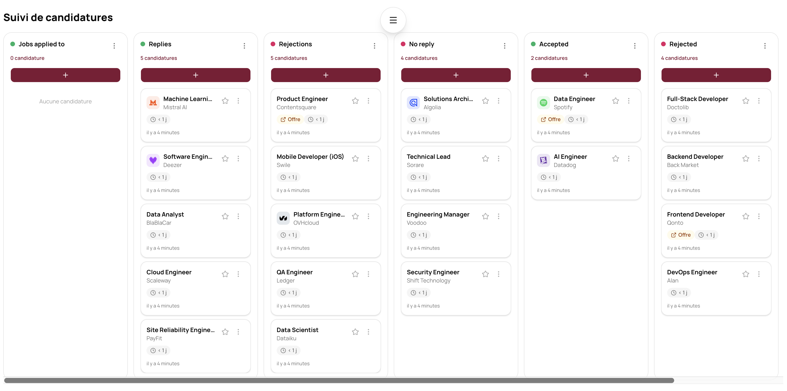
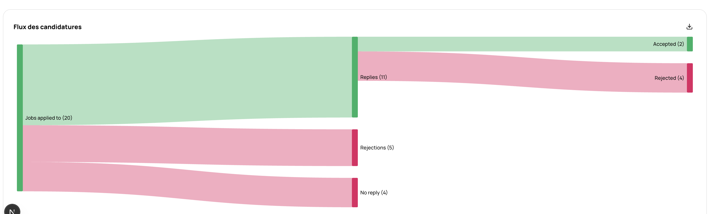
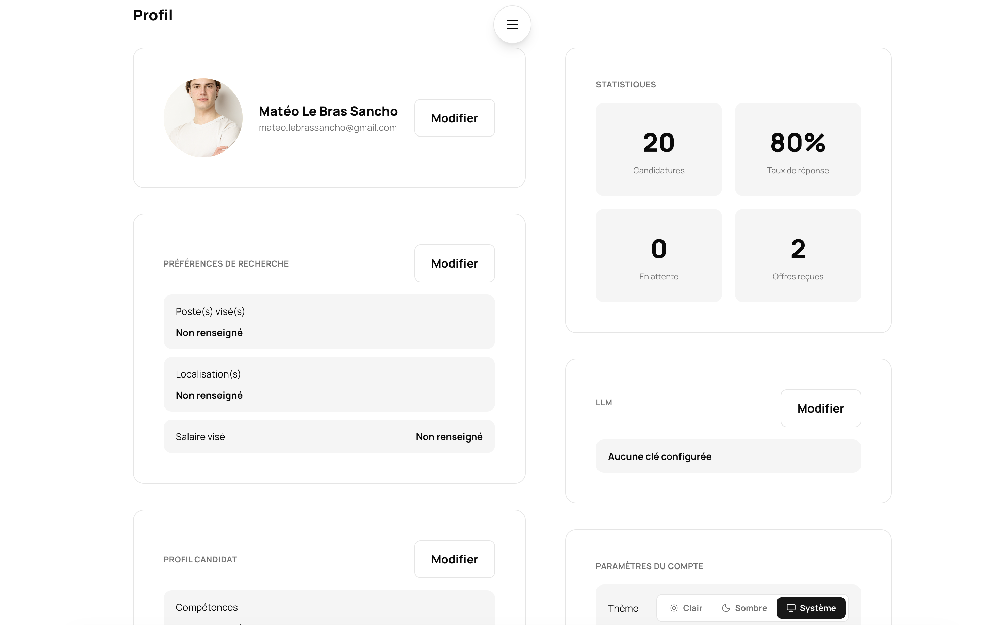

# DreamTrack

## Live version 📡

https://dreamtrack.164-132-44-243.sslip.io/

## Introduction

DreamTrack est un outil de suivi de candidatures qui combine un tableau Kanban et une
visualisation de flux en temps réel, avec un coup de pouce de l'IA pour repérer les
bonnes offres et évaluer vos chances avant même de postuler.

## Un Kanban qui s'adapte à votre process

Suivez chaque candidature dans un tableau en glisser-déposer, avec des colonnes
entièrement personnalisables : ajoutez, renommez, réordonnez ou supprimez des étapes
pour coller exactement à votre façon de chercher un emploi.

## Visualisez votre parcours de recherche

Chaque déplacement de carte alimente un diagramme de Sankey généré en temps réel, qui
agrège l'ensemble de vos candidatures pour révéler où elles s'accumulent, où elles
stagnent, et où elles aboutissent.

## Un profil qui affine le matching

Renseignez votre profil — poste visé, localisation, prétentions salariales,
compétences — et suivez vos statistiques clés (candidatures envoyées, taux de réponse,
offres reçues) en un coup d'œil.

## Repérage et scoring automatiques par IA

DreamTrack scanne les job boards pour vous, analyse chaque offre et lui attribue un
score de correspondance basé sur votre profil : exigences techniques, niveau
d'expérience et adéquation avec vos soft skills. Fini les heures perdues à trier des
offres qui ne vous correspondent pas.

## Stack Technique

Next.js, TypeScript, Drizzle, TanStack Query/Form, dnd-kit et d3-sankey pour une
expérience rapide et fluide.
